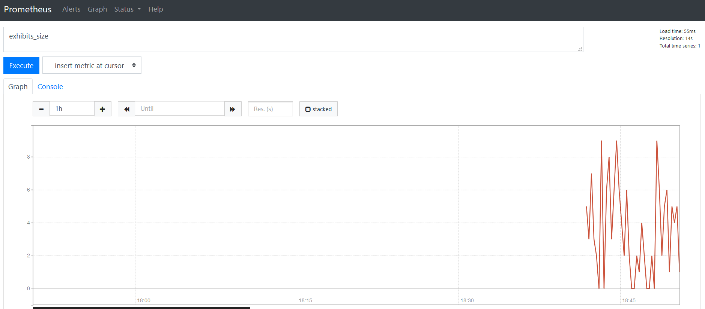

## Purpose of this application
This application demonstrate basic usage Micrometer. In metrics we can see number of exhibits in Museum, visit time and number of entries. Prometheus use it to collect Metrics from application.

## How to find metrics
After running app just enter [http://localhost:8080/actuator/prometheus](http://localhost:8080/actuator/prometheus)

We can see there metrics from JVM, but also custom Metrics for Museum under tag "museum" ({name="museum",})

## How to run application
**Note**: Basic knowledge of [Docker](https://www.docker.com/) is required

1. Build jar file using maven
    - mvn clean install
    
2. Build and run docker image with demo application
    - docker build -t elenx/monitoring .
    - docker run -d --name=monitoring -p 8080:8080 elenx/monitoring

3. Run prometheus:
    - $ docker run -d --name=prometheus -p 9090:9090 -v <PATH_TO_prometheus.yml_FILE>:/etc/prometheus/prometheus.yml prom/prometheus --config.file=/etc/prometheus/prometheus.yml

4. See metrics
Enter [http://localhost:9090/graph](http://localhost:9090/graph) to see metrics from application.

Just write name of your metric as a query, eg. "exhibits_size"

